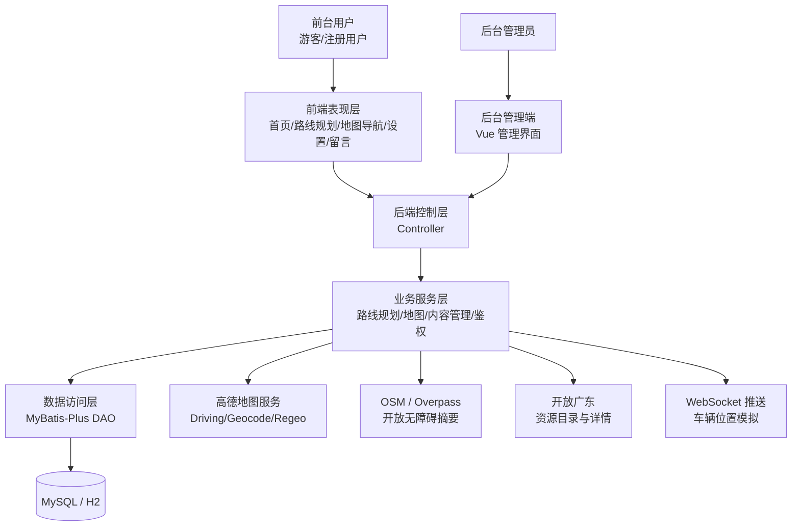
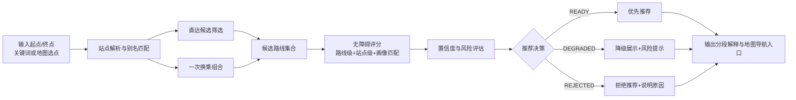
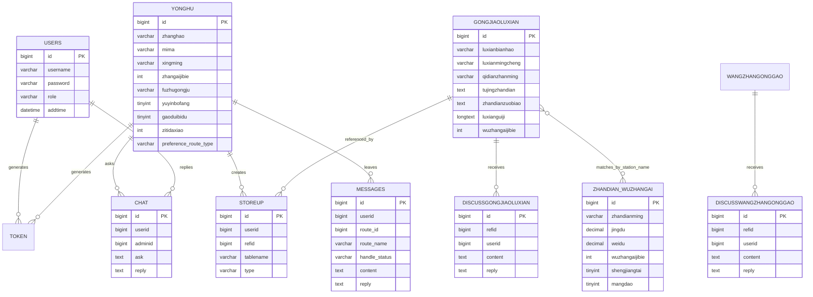
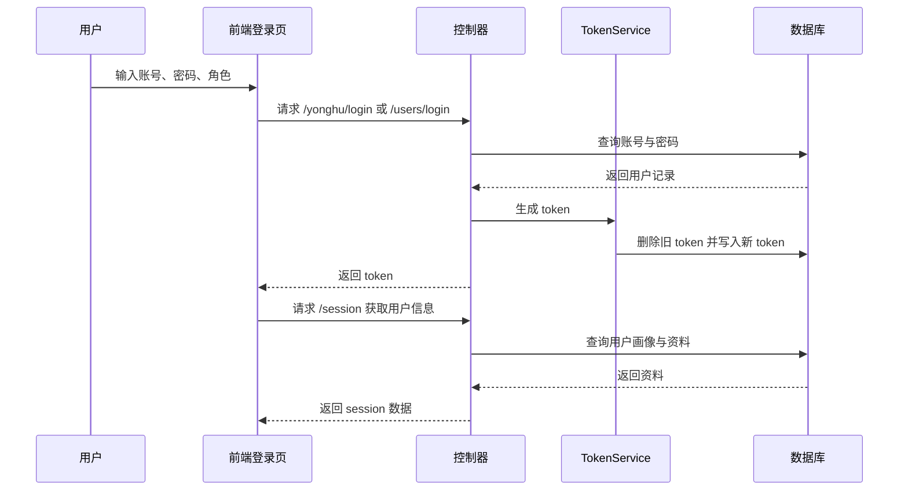
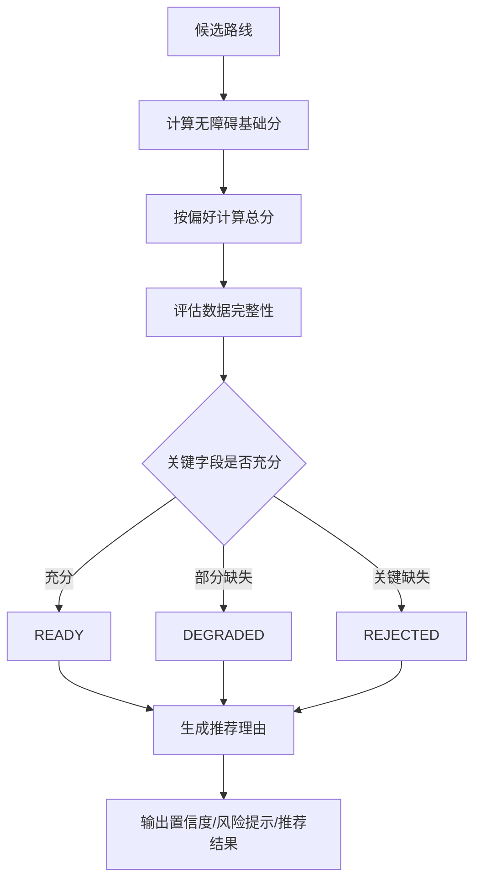
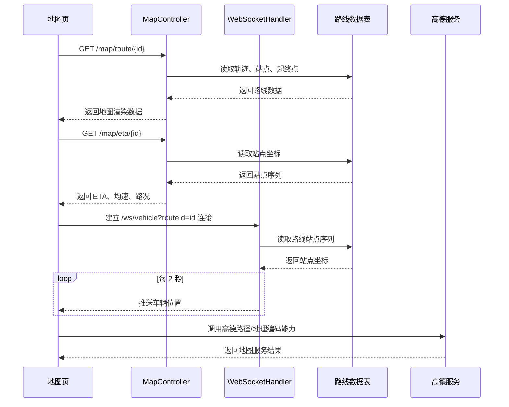
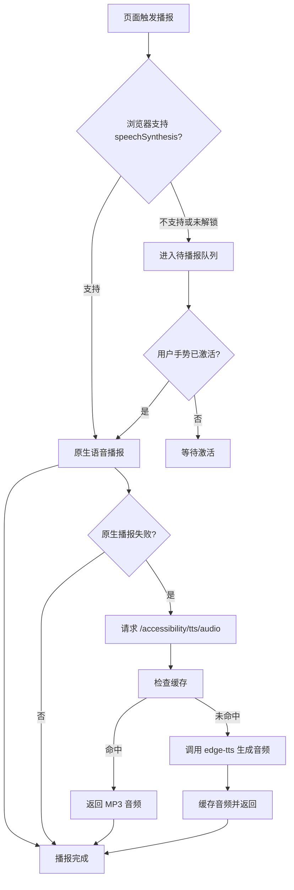

# 《无障碍公交查询与推荐系统的设计与实现》章节补写稿

> 适用位置：论文“第4章 系统设计（若学校目录写作‘系统设置’，可将本章标题替换）”与“第5章 系统实现”  
> 分析基线：GitHub `Ruler4396/bus-route-query-system`，提交 `804f1b6`  
> 代码核对范围：`Spring Boot + MyBatis-Plus + MySQL/H2 + Vue2/Layui/jQuery + AMap/Leaflet + WebSocket`  
> 说明：本稿按照参考论文《校园订餐系统设计与实现》的章节组织方式、语气和写法整理，同时结合本项目真实代码结构进行了项目化改写。图示全部使用 Mermaid，便于后续导出或二次排版。

---

# 第4章 系统设计

## 4.1 系统总体架构

根据前文的需求分析，为实现一个能够同时满足公交线路查询、无障碍推荐、地图导航展示和后台运营管理的综合系统，本文采用前后端分离、模块化分层设计的方法完成系统总体架构设计。系统在功能上既要保证普通公交查询功能的可用性，又要突出轮椅/行动不便用户、低视力用户等特殊群体的差异化出行需求，因此在传统信息管理系统结构之上，进一步增加了无障碍画像、推荐评分、风险提示和分段解释等业务层能力。

本系统整体上可分为用户交互层、前端表现层、后端业务层、数据存储层和外部服务层五个部分。其中，用户交互层分别面向前台用户和后台管理员；前端表现层负责首页总览、路线规划、地图导航、无障碍设置、留言反馈等页面展示；后端业务层负责登录鉴权、路线候选查询、一次换乘组合、无障碍评分、地图接口封装、实时位置推送和内容管理；数据存储层负责用户、公交路线、站点无障碍信息、留言、公告、收藏等业务数据保存；外部服务层则负责接入高德地图、OpenStreetMap/Overpass、开放广东等外部开放能力。

从实现角度看，前台页面主要分布在 `src/main/resources/front/front/` 目录下，采用 Vue2、Layui、jQuery 和页面级脚本协同完成；后台管理端位于 `src/main/resources/admin/admin/`，采用 Vue 单页应用方式组织；后端业务代码位于 `src/main/java/com/` 下，遵循 `Controller → Service → DAO → Entity` 的分层结构，整体层次较为清晰，便于后续维护与答辩说明。



图4-1 系统总体架构图

为了保证系统的可扩展性，本系统在路线规划核心部分没有把站点匹配、候选线路筛选、评分判断等逻辑全部固化在控制器中，而是集中放置在业务服务层，并进一步拆分为 `RouteStationMatchService`、`RouteCandidateQueryService` 和 `RoutePlanningService` 等模块。这种设计方式能够降低模块之间的耦合度，使系统在后续扩展更多画像类型、更多试点线路或更多推荐规则时具备较好的延展能力。

## 4.2 系统模块设计

### 4.2.1 用户与画像模块设计

用户与画像模块是本系统实现差异化无障碍推荐的基础模块。与一般公交查询系统只记录账号密码不同，本系统除了保留管理员账户表 `users` 和普通用户表 `yonghu` 的基本账户信息外，还在普通用户表中增加了障碍级别、辅助工具、语音播报开关、高对比度开关、字体大小、键盘导航、触觉反馈和优先路线类型等字段。这些字段不仅用于页面显示偏好的保存，更直接参与后续无障碍推荐策略的选择。

从角色划分来看，系统将用户分为前台普通用户和后台管理员两类。普通用户可以进行注册、登录、个人资料维护、无障碍设置、路线查询、收藏、留言和在线提问等操作；后台管理员则可以对路线数据、公告、留言、友情链接和用户信息进行统一管理。通过双角色分离设计，系统能够既满足普通用户的出行使用场景，又保证后台维护工作的独立性和安全性。

表4-1 用户与画像模块主要功能表

| 功能名称 | 功能说明 |
|---|---|
| 账户注册与登录 | 支持普通用户注册、登录和退出，管理员通过独立后台入口登录 |
| 画像信息维护 | 保存障碍级别、辅助工具、语音播报、高对比度、字体大小等参数 |
| 偏好策略设置 | 支持智能推荐、距离优先、时间优先、无障碍优先等策略配置 |
| 个人中心管理 | 支持查看和修改个人资料、退出登录、进入个性化服务页面 |
| 会话状态管理 | 通过 token 表维护登录态，并配合拦截器控制接口访问 |

在模块设计上，本系统没有把“用户信息”和“无障碍设置”完全分开，而是把用户画像视为用户资料的一部分统一管理，这样可以减少前后端交互复杂度，也便于在路线规划时直接读取画像参数，实现“用户登录—画像识别—推荐排序”的顺序闭环。

### 4.2.2 路线查询与无障碍推荐模块设计

路线查询与无障碍推荐模块是本系统的核心模块，其目标不是简单返回一条线路名称，而是根据用户输入的出发地、目的地和画像特征，给出更适合无障碍场景的候选出行方案。该模块在设计时主要解决三个问题：一是如何从已有线路数据中筛出可能可行的直达方案与一次换乘方案；二是如何根据无障碍信息对候选方案进行评分排序；三是当关键数据不足时，系统应如何进行降级提示或拒绝推荐。

前端在路线规划页中支持两种输入方式：一种是直接输入地点关键词，另一种是通过地图选点完成起终点选择。输入完成后，系统会先根据站点别名、模糊匹配和坐标邻近关系进行站点解析，再由后端生成候选路线。候选路线不仅包括直达线路，还包括一次换乘的合成方案。对于合成方案，系统会记录换乘站点、首段线路、次段线路以及合并后的站点序列，用于后续地图渲染和分段解释。

在评分设计方面，系统采用“路线级无障碍信息 + 站点级无障碍信息 + 用户画像匹配度”的三层评分方式，并在此基础上增加置信度判断、风险提示和推荐决策状态。也就是说，系统不会在数据明显缺失时仍强行输出高可信推荐，而是通过 `READY`、`DEGRADED`、`REJECTED` 等状态让用户明确知道当前结果的可信边界。



图4-2 路线查询与无障碍推荐模块流程图

该模块设计的重点在于，系统不再把“最短时间”作为唯一目标，而是根据画像动态调整排序目标。例如，对轮椅/行动不便用户会更加关注坡道、电梯和低地板车辆信息；对低视力用户则会更加关注语音播报、盲道支持和导盲犬支持说明。通过这种设计，路线推荐结果能够更符合无障碍出行场景下的真实决策逻辑。

### 4.2.3 地图导航与动态信息模块设计

地图导航与动态信息模块主要负责将公交路线、站点位置、换乘节点、车辆位置和到站时间以可视化方式展示给用户。由于毕业设计项目既要保证界面效果，又要考虑演示环境中外部服务可能失效的问题，因此系统在地图设计上采用“高德地图为主，Leaflet 为兜底”的双引擎方案。

在地图数据组织上，系统为每条公交线路保存起点坐标、终点坐标、站点坐标 JSON 和轨迹坐标 JSON。地图页优先读取路线轨迹和站点坐标进行渲染，同时支持在路线规划页保存用户当前选择的路线方案，并一键带入地图导航页，实现“路线规划页—地图页”的联动切换。为了增强动态展示效果，系统还设计了车辆位置实时推送和 ETA 估算功能，使地图页不仅能展示静态线路，还能展示车辆移动和到站预测结果。

```mermaid
flowchart TB
    A[路线规划页选择方案] --> B[保存当前路线选择]
    B --> C[地图导航页读取方案]
    C --> D[请求 /map/route/{id}]
    C --> E[请求 /map/stations/{id}]
    C --> F[建立 /ws/vehicle WebSocket 连接]
    C --> G[请求 /map/eta/{id}]
    D --> H[绘制轨迹与站点]
    E --> H
    F --> I[刷新车辆位置]
    G --> J[展示到站时间与交通状态]
    H --> K[形成完整导航视图]
    I --> K
    J --> K
```

图4-3 地图导航与动态信息模块结构图

在模块设计上，本系统没有把地图仅仅作为“展示图片”的窗口，而是把它设计成与推荐结果相互联动的导航核心界面。用户在路线规划页中点击候选路线后，可以直接进入地图页查看路线轨迹、换乘节点、上下车站和 ETA 信息，从而提升整体使用体验。

### 4.2.4 无障碍交互与信息反馈模块设计

无障碍交互模块是本系统区别于传统公交查询系统的重要组成部分。该模块主要包括语音播报、高对比度主题、键盘导航、焦点可见性、触觉反馈以及屏幕阅读器适配等功能。系统将这些能力封装在统一的前端无障碍工具库中，使首页、路线页、设置页、地图页等多个页面都能够复用同一套交互机制。

信息反馈模块则主要包括留言建议、在线提问、路线评论和公告评论等内容，目的是让用户在使用系统过程中能够提交问题、反馈风险点或补充体验感受，而管理员则可在后台对这些内容进行查看和处理。这样一来，系统不仅是一个查询平台，也具备了基础的信息回流能力，为后续试点数据修正和系统改进提供依据。

### 4.2.5 后台运营管理模块设计

后台运营管理模块主要用于管理员对系统数据进行维护和运营控制。该模块采用 Vue 单页应用方式构建，包含公交路线管理、普通用户管理、管理员管理、公告管理、留言审核、友情链接管理、收藏与评论管理等页面。管理员登录后可通过统一的侧边导航进入不同管理界面，对前台展示数据和互动数据进行编辑、删除、导出和审核。

后台模块设计不仅面向“增删改查”这一基本需求，还考虑到毕业设计答辩中的演示完整性，因此系统额外加入了路线导出 Excel、消息审核和展示配置等功能。通过该模块，管理员可以在不直接修改数据库的情况下完成大部分演示数据维护工作，提高了系统使用的便利性。

## 4.3 数据库设计

### 4.3.1 概念结构设计

本系统采用 MySQL 作为主要业务数据库，同时在演示环境中提供 H2 文件数据库作为轻量级替代方案。根据项目初始化脚本 `init-db.sql` 和演示脚本 `schema-demo.sql` 可以看出，系统当前共设计了 13 张核心业务表，主要包括管理员表、普通用户表、公交路线表、站点无障碍信息表、公告表、友情链接表、留言建议表、在线提问表、收藏表、配置表、token 表以及两张评论表。

从概念结构上看，系统中的核心实体主要包括“管理员”“普通用户”“公交路线”“站点无障碍信息”“公告”“留言”“收藏”和“评论”等。其中，普通用户与收藏、留言、在线提问、评论等实体之间存在一对多关系；公交路线与评论、收藏之间存在逻辑关联关系；公交路线与站点无障碍信息之间虽然未建立强制外键，但通过站点名称和站点坐标形成业务上的逻辑映射关系，用于无障碍评分和地图解释。



图4-4 数据库 E-R 关系图

在概念结构设计中，本系统特别保留了公交路线表中的站点坐标 JSON 和轨迹 JSON 字段。这种设计虽然不是完全规范化的第三范式设计，但它更适合毕业设计系统的演示场景。一方面，它可以减少多表关联查询带来的实现复杂度；另一方面，它能够直接服务于地图轨迹绘制、前端站点提示和一次换乘合成方案生成。因此，这是一种面向展示和功能落地的折中设计。

### 4.3.2 逻辑结构设计

在逻辑结构设计上，系统将高频核心数据和辅助展示数据分开组织。公交路线表 `gongjiaoluxian` 是系统的核心业务表，保存线路编号、路线名称、起终点、途经站点、轨迹信息和无障碍字段；站点无障碍信息表 `zhandian_wuzhangai` 主要保存站点名称、经纬度和站点设施信息；普通用户表 `yonghu` 负责用户画像和偏好参数；`messages`、`chat`、`storeup` 等表则主要服务于互动与反馈功能。

表4-2 核心数据表说明

| 数据表 | 主要作用 | 关键字段 |
|---|---|---|
| `users` | 管理员账户信息 | `username`、`password`、`role` |
| `yonghu` | 普通用户信息与画像配置 | `zhanghao`、`zhangaijibie`、`fuzhugongju`、`gaoduibidu`、`preference_route_type` |
| `gongjiaoluxian` | 公交路线主体数据 | `luxianbianhao`、`qidianzhanming`、`tujingzhandian`、`zhandianzuobiao`、`luxianguiji` |
| `zhandian_wuzhangai` | 站点级无障碍信息 | `zhandianming`、`wuzhangaijibie`、`shengjiangtai`、`mangdao` |
| `messages` | 留言与审核信息 | `content`、`reply`、`route_id`、`handle_status` |
| `chat` | 在线提问与后台回复 | `ask`、`reply`、`isreply` |
| `storeup` | 收藏、点赞和踩记录 | `userid`、`refid`、`tablename`、`type` |
| `token` | 登录凭证与过期时间 | `userid`、`token`、`expiratedtime` |
| `wangzhangonggao` | 网站公告数据 | `biaoti`、`jianjie`、`neirong` |
| `youqinglianjie` | 外部资源链接 | `lianjiemingcheng`、`lianjie` |

除此之外，系统还提供 `schema-demo.sql` 和 `data-demo.sql` 用于演示环境初始化。在该方案中，H2 文件数据库与 MySQL 保持近似的表结构，预置了 12 条广州试点演示路线、1 个演示用户和公告、友情链接、留言等示例数据。这种设计有利于在本地环境快速恢复演示数据，提高系统的可部署性和可演示性。

---

# 第5章 系统实现

## 5.1 登录与用户画像功能实现

在本系统中，登录功能由普通用户登录和管理员登录两条路径组成。前台登录页位于 `pages/login/login.html`，用户输入账号和密码后，前端会根据所选择的身份向 `/yonghu/login` 或 `/users/login` 发送请求。后端控制器接收到请求后，先通过 `EntityWrapper` 查询对应账号，再判断密码是否正确；若验证通过，则调用 `TokenServiceImpl.generateToken()` 生成 24 小时有效的 token，并写入 `token` 表中，最后返回给前端保存。这样便实现了前后台角色分离和登录态管理。

与参考论文中常见的“登录后才能使用所有功能”不同，本系统在实现时保留了游客浏览公共功能的能力。也就是说，公告、路线列表、资源链接和部分地图信息可以在未登录状态下浏览，而收藏、留言提交、个人中心和画像配置等个性化功能则需要登录后才能使用。这种实现方式更符合公交信息服务的实际使用习惯，也降低了用户首次进入系统时的操作门槛。

在用户画像实现方面，系统将无障碍配置集成在用户资料中保存。例如，当用户在设置页开启高对比度、调整字体大小、启用语音播报或选择“无障碍优先”路线偏好后，前端会把这些参数提交至用户信息表，后端则在推荐时将这些字段转化为画像约束。对于未登录用户，系统还提供了虚拟画像机制，即通过 `profileType` 参数临时模拟“轮椅/行动不便”“低视力”“听障”等不同服务画像，从而保证在演示环境中不登录也能对比不同推荐结果。



图5-1 登录与用户画像实现流程图

## 5.2 路线查询与无障碍推荐功能实现

### 5.2.1 起终点输入与站点匹配实现

路线规划页的核心前端逻辑位于 `route-list-page.js`、`route-list-core.js` 和 `route-list-picker.js` 三个文件中。系统首先从 `route/all-routes` 接口拉取全量线路数据，并构建本地站点索引。为了提高输入容错率，前端还内置了站点别名映射，例如“中山医”“海珠广场”“纸厂地铁燕岗站”等站点都配置了常见别名，用户只需输入部分关键词即可得到候选站点建议。系统默认仅展示最相关的 12 条候选结果，以避免候选列表过长影响使用体验。

当用户采用地图选点方式输入起终点时，系统会在地图上记录点击坐标，并结合附近站点的距离进行最近站点匹配；当用户采用文本输入时，系统则优先根据站点名称、别名和模糊包含关系完成解析。通过这两种输入方式的结合，系统既适合熟悉公交站名的用户，也适合只知道大致地理位置的用户。

### 5.2.2 直达与一次换乘候选生成实现

后端的候选路线查询主要由 `RouteCandidateQueryServiceImpl` 完成。系统会先遍历所有公交路线，筛选出与起点关键词匹配的线路集合和与终点关键词匹配的线路集合。若某条线路同时可覆盖起点与终点，则可直接作为直达候选方案；若不存在合适的直达线路，系统会进一步尝试将“起点侧线路”和“终点侧线路”进行组合，寻找公共换乘站点，并最多生成 6 条一次换乘的合成方案。

对于合成换乘方案，系统不会只保存“第一段 + 第二段”的文字说明，而是会进一步合并两段线路的站点序列、坐标信息和轨迹信息，生成新的临时 `GongjiaoluxianEntity` 对象。该对象包含起点站、终点站、合并后的途经站点、换乘节点、换乘设施说明以及叠加后的无障碍字段，用于后续评分、地图渲染和结果展示。这样一来，前端在处理换乘方案时可以把它看作与普通路线一致的数据结构，降低了页面逻辑复杂度。

### 5.2.3 无障碍评分与推荐决策实现

无障碍推荐核心逻辑位于 `RoutePlanningServiceImpl` 中。系统首先调用 `calculateAccessibilityScore()` 计算候选路线的无障碍基础分，其默认评分管线由路线级规则、站点级规则和用户匹配规则三部分组成，默认权重分别为 0.4、0.3 和 0.3。其基本计算思想可表述为：

`S_access = (0.4 × S_route + 0.3 × S_station + 0.3 × S_user) / (0.4 + 0.3 + 0.3)`

其中，`S_route` 主要反映线路本身的无障碍等级、语音播报、盲道、导盲犬支持和设施说明；`S_station` 反映沿线站点的升降台、盲道、盲文站牌、爱心座椅和无障碍厕所等条件；`S_user` 则根据用户画像动态判断线路对轮椅用户、低视力用户或听障用户的适配程度。

在得到无障碍基础分后，系统还会根据用户偏好进一步计算总评分。例如，当用户选择“无障碍优先”时，总评分更加偏重无障碍分；当用户选择“时间优先”时，总评分则更多参考站点数推导出的时间分；当用户选择“距离优先”时，总评分又会适当提高距离分权重。若某条路线被评估为“降级候选”，系统会对总评分扣减 8 分；若被评估为“拒绝推荐”，则额外扣减 35 分，从而在最终排序中自动后移。

更重要的是，系统在评分之后不会直接输出排序结果，而是还会执行 `assessRoute()` 方法，对路线的关键字段完整性进行二次判断，生成 `READY`、`DEGRADED`、`REJECTED` 等推荐状态。例如，轮椅用户场景下若线路缺少坡道或电梯说明，系统会提示“关键换乘是否可达仍需核对”；若低视力用户场景下同时缺少语音播报和盲道信息，系统则可能直接拒绝推荐。这样可以避免系统在关键无障碍数据缺失时输出误导性较强的结果。



图5-2 路线推荐与风险决策实现图

### 5.2.4 分段解释与前端结果渲染实现

为了提高路线结果的可解释性，系统在生成推荐结果时没有只返回一条线路名称和一个总分，而是通过 `buildRouteSegments()` 方法把整个出行过程拆分为“出发步行段”“上车站可达性”“乘车段”“换乘段”“下车站可达性”“到达步行段”六个部分。每个部分都包含状态、距离估算、说明文字和数据来源等信息，便于前端展示细节，也便于语音播报和字幕朗读。

前端在拿到 `/route/plan` 或 `/route/plan/summary` 的返回结果后，会把推荐理由、置信度、风险提示、上下车站、换乘次数、首末段距离和总耗时等信息渲染为单列候选卡片。用户点击某一条候选路线后，系统会把该方案缓存到本地存储中，并自动跳转至地图导航页继续查看。通过这样的实现方式，路线规划页和地图页之间形成了较为完整的交互闭环。

## 5.3 地图展示、实时推送与 ETA 预测功能实现

地图展示功能由 `MapController` 与前端地图页共同完成。当前端请求 `/map/route/{id}` 时，后端会返回线路编号、路线名称、起终点坐标、站点坐标 JSON、路线轨迹 JSON 和途经站点信息；请求 `/map/stations/{id}` 时，系统则返回站点坐标列表，若原始站点坐标缺失，则自动生成可用于演示的模拟坐标。这种设计保证了即使部分演示数据不完整，地图页仍然能够正常展示基础功能。

在地图引擎选择上，系统采用高德地图作为主显示引擎，并保留 Leaflet 作为失败兜底方案。前端会优先尝试加载高德 JS API 及其路径规划能力，在可用时以高德地图完成底图展示和路径绘制；若高德服务加载失败，则自动回退到 Leaflet，以保证系统在网络受限或密钥异常情况下仍可完成展示任务。根据当前项目 README 中的说明，路线轨迹的渲染优先级为“高德公交轨迹 > 本地轨迹 JSON > 站点直连”，从而兼顾了展示效果和稳定性。

车辆位置实时展示由 `VehiclePositionWebSocketHandler` 实现。客户端建立 `/ws/vehicle?routeId={id}` 连接后，后端会读取该路线的站点坐标序列，并按照定时任务每 2 秒推送一次当前车辆位置。若路线存在结构化站点坐标，则系统使用真实坐标序列进行推送；若路线数据不足，则回退为模拟站点坐标。这一功能虽然是演示性质的实时位置更新，但它可以直观体现出系统具备从静态查询向动态服务延伸的能力。

ETA 预测功能则由 `/map/eta/{id}` 接口提供。该接口根据当前站点索引、剩余站点数和站点坐标列表计算剩余距离，再结合交通时段因子和停站时间估算到站分钟数。系统默认基准速度为 24 km/h，并根据“拥堵、正常、畅通”三种交通状态分别调整速度系数和每站停靠时间。若坐标数据缺失，系统还会回退到按剩余站点数估算距离的模型，以避免接口不可用。



图5-3 地图展示、实时推送与 ETA 功能实现图

## 5.4 无障碍交互功能实现

本系统的无障碍交互功能主要由前端文件 `accessibility.js` 完成。该工具库统一封装了语音播报、重复播报去重、移动端手势激活、音频兜底、高对比度主题切换、键盘导航、焦点管理和基础 ARIA 支持等功能。系统在页面初始化时会根据本地存储和用户画像恢复无障碍设置，并在路线规划、地图导航、登录页、设置页等多个界面中共享这些能力，从而保证整体交互风格一致。

其中，语音播报功能在实现上兼顾了浏览器原生能力和离线/降级场景。当浏览器支持 `speechSynthesis` 时，系统优先使用原生语音合成；当浏览器不支持或移动端尚未完成用户手势解锁时，系统会把播报内容放入待播报队列，待满足条件后继续播报。为了避免同一段提示被连续重复读出，系统还设计了去重窗口机制，在短时间内对重复文本进行忽略处理。

除前端原生语音外，项目还实现了后端兜底语音接口 `accessibility/tts/audio`。该接口会先对文本长度进行限制，再基于缓存目录查找是否已有已生成音频；若没有，则调用 `edge-tts` 生成 MP3 音频。该过程设置了最大文本长度 180 个字符、最大重试次数 1 次和 45 秒超时限制，并将音频结果缓存到 `runtime/tts-cache` 下，以避免重复生成带来的不必要资源消耗。这种实现方式既符合演示系统对稳定性的要求，也体现了对无限重试和无边界消耗风险的治理意识。



图5-4 无障碍语音播报实现图

此外，高对比度主题通过独立 CSS 文件 `accessibility-high-contrast.css` 实现；设置页通过 `accessibility-settings-page.js` 读取和修改用户偏好；路线规划页在低视力画像下还会自动启用高对比模式。这样一来，系统不仅能提供“看得见”的无障碍信息，还能通过“听得到”“操作得到”的方式改善整体可用性。

## 5.5 内容互动与后台管理功能实现

系统的内容互动功能主要包括留言建议、在线提问、路线评论和公告评论四部分。其中，留言建议模块对应 `messages` 表和 `MessagesController`，用户可提交带有反馈类型、严重级别、关联路线和站点信息的留言，管理员则可在后台查看、审核、回复和记录处理状态；在线提问模块对应 `chat` 表和 `ChatController`，用于完成用户与管理员之间的简易问答；路线评论与公告评论则分别对应 `discussgongjiaoluxian` 和 `discusswangzhangonggao` 两张表，用于记录用户对具体内容的互动信息。

后台管理功能则集中在 Vue 管理端中实现，主要页面位于 `src/main/resources/admin/admin/src/views/modules/` 目录下。管理员登录后台后，可以进入公交路线、公告、留言、用户、友情链接等管理界面进行增删改查操作。以公交路线模块为例，管理员可通过列表页查看和检索现有线路，也可进入新增/编辑页面维护路线基本信息和无障碍字段。对于演示答辩常用的数据汇总需求，系统还提供了 Excel 导出能力：管理员在路线管理列表页可直接调用 `/gongjiaoluxian/export` 接口，将当前筛选结果导出为 `gongjiaoluxian-export.xlsx` 文件。

后台模块的实现特点在于，它并不仅仅用于“录入数据”，而是承担了整套系统的运营支撑角色。前台展示效果、路线数据质量、留言反馈处理和公告更新，都可以通过后台统一维护。这样既保证了数据维护的便利性，也使系统在毕业设计答辩中更容易呈现“前台服务 + 后台运营”的完整闭环。

## 5.6 系统部署与运行保障实现

为了兼顾开发环境、演示环境和远端部署环境，本系统在部署实现上采用了“主库 MySQL + 演示库 H2 + Docker/脚本化运维”的组合方式。标准运行配置写在 `application.yml` 中，使用 MySQL 作为业务数据库；演示环境配置写在 `application-demo.yml` 中，使用 H2 文件数据库，并通过 `schema-demo.sql` 和 `data-demo.sql` 自动创建表结构和初始化演示数据。这样一来，即使没有完整的 MySQL 环境，也可以快速拉起一套可展示的轻量演示系统。

从工程文件结构来看，项目根目录下提供了 `Dockerfile`、`docker-compose.yml` 和 24 个脚本文件，用于支持启动、停止、构建、远端检查、单实例部署、数据重置、后台资源同步和运行状态检测等操作。例如，`single-demo-deploy.sh` 可用于单实例部署，`single-demo-smoke.sh` 可用于关键链路烟雾测试，`reset-single-demo-data.sh` 可快速恢复演示数据库，`sync-admin-runtime-assets.sh` 则用于统一后台运行时静态资源版本。这些脚本在项目运行中起到了保障演示稳定性和提高维护效率的作用。

系统还通过 `InterceptorConfig`、`WebSocketConfig` 和 `SchedulingConfig` 等配置类完善了运行边界控制。其中，拦截器会对大部分业务接口进行登录态检查，但排除 `/map/**` 和 `/ws/**` 这类需要公开访问的地图和实时推送接口；WebSocket 配置类负责注册车辆位置推送端点；调度器配置类则为定时任务显式指定线程池，避免默认调度器与 WebSocket 推送之间产生冲突。通过这些实现，系统在单体架构下仍具备较为完整的可运行性与可维护性。

最后，为核对本次分析所依据代码基线的可编译性，本文已在临时拉取的 GitHub 完整仓库上执行 `mvn -q -DskipTests compile`，编译过程通过。这说明项目当前源码结构完整，能够支撑论文中关于系统实现部分的描述。

## 5.7 本章小结

本章从登录与画像、路线推荐、地图导航、无障碍交互、后台管理和运行保障六个方面，对无障碍公交查询与推荐系统的关键实现进行了说明。可以看出，本系统并非只停留在传统信息管理系统的“增删改查”层面，而是在公交路线查询的基础上，进一步实现了画像驱动推荐、一次换乘组合、置信度评估、风险提示、地图动态展示和语音无障碍支持等功能。通过这些实现，本系统已经能够形成较为完整的“前台查询—推荐解释—地图验证—后台维护”的业务闭环，为后续系统测试、结果分析和论文总结奠定了基础。
